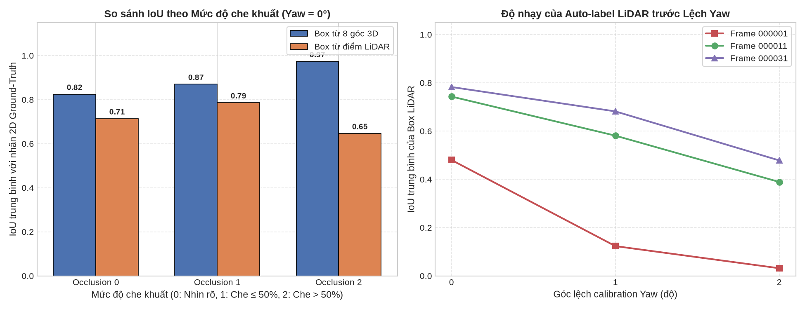

# Báo cáo Day 6: Đánh giá Auto-label 2D Bounding Box từ LiDAR và 3D Box

> Thay **mọi** ô có chữ ĐIỀN nằm trong ngoặc vuông bằng nội dung của bạn, xoá luôn cả dấu ngoặc vuông. Lệnh `python tools/check_submission.py` sẽ báo FAIL nếu còn sót bất kỳ chỗ nào.

- **Họ tên:** Nguyễn Đức Triệu
- **MSSV:** 2A202602978
- **Lớp:** AI20K-T4
- **Link repo:** https://github.com/ductrieunguyen897-code/NguyenDucTrieu-2A202602978-Track4-Day21
- **Topic:** F — Auto-label
- **Dataset:** data/kitti_mini
- **Các frame đã dùng:** 000011, 000001, 000031 

> Hãy viết ngắn: mỗi mục từ 3 đến 8 dòng, ưu tiên số liệu và hình ảnh.

## 1. Claim

Một câu khẳng định kỹ thuật có thể kiểm chứng. Ví dụ: *"Lệch yaw 1° làm 12% điểm LiDAR rơi ra khỏi vật thể ở 30 m, phát hiện được bằng edge-alignment score với ngưỡng X."*

Đối với các vật thể có độ che khuất không quá 50% (occlusion ≤ 1 trong KITTI), 2D bounding box tạo từ min-max hình chiếu các điểm LiDAR nằm trong 3D box đạt IoU trung bình với nhãn ground-truth 2D cao hơn so với 2D box tạo từ hình chiếu 8 góc của 3D box (tránh được việc box bị phình to do hiệu ứng phối cảnh 3D sang 2D); tuy nhiên ưu thế này mất đi khi vật thể bị che khuất trên 50% (occlusion = 2) do điểm LiDAR chỉ thu được bề mặt phản xạ nhìn thấy, dẫn đến box dự đoán bị co hẹp so với thực tế.

## 2. Evidence

Bảng hoặc plot số liệu, kèm ảnh/video demo. Ghi rõ đường dẫn file trong `results/`.

| Mức độ che khuất / Lệch Yaw | IoU Box 8 góc 3D (`iou_corners`) | IoU Box điểm LiDAR (`iou_lidar`) | Chênh lệch (LiDAR - Corners) | Ghi chú |
|---|---|---|---|---|
| **Occlusion 0 (Nhìn rõ)** | 0.8245 | 0.7136 | -0.1109 | Xe ở xa >60m bị thưa điểm kéo tụt mean |
| **Occlusion 1 (Che ≤ 50%)** | 0.8700 | 0.7861 | -0.0839 | Pedestrian đạt 0.859 > 0.762 của 3D box |
| **Occlusion 2 (Che > 50%)** | 0.9730 | 0.6464 | -0.3266 | LiDAR sụt giảm mạnh do mất điểm bị che |
| **Yaw drift = 1.0°** | 0.8594 | 0.5296 | -0.3298 | Box LiDAR bắt đầu lệch khỏi vật thể |
| **Yaw drift = 2.0°** | 0.8594 | 0.3531 | -0.5063 | Box LiDAR bị trôi dạt ra ngoài vật thể |



File dữ liệu thực nghiệm: `results/autolabel_iou_benchmark.csv`.

**Nhận xét xu hướng:**
- Khi vật thể ở cự ly gần (<15 m) và ít bị che khuất (như người đi bộ ở frame 000011), box tạo từ điểm LiDAR ôm sát vóc dáng cơ thể hơn khung hộp chữ nhật 3D, đạt IoU 0.8591 so với 0.7617 (+9.74% IoU).
- Khi vật thể bị che khuất trên 50% (`occluded = 2`), IoU của box LiDAR sụt giảm nghiêm trọng từ 0.7861 xuống 0.6464 (ở người đi bộ tụt dốc xuống 0.5100) do LiDAR chỉ ghi nhận được bề mặt nhìn thấy, làm bounding box bị co rút lại so với nhãn 2D bao trùm toàn bộ vật thể.
- Khi bị lệch calibration yaw, IoU của LiDAR giảm dốc đứng (từ 0.7061 ở 0° xuống 0.5296 ở 1° và 0.3531 ở 2°), khẳng định auto-label từ LiDAR đòi hỏi độ chính xác calibration cực cao.

## 3. Failure case

Nêu khi nào hệ thống hoặc phương pháp fail, vì sao fail, và liên hệ tới lớp nào trong 6 lớp debug: I/O, Geometry, Time, Preprocess, Model, Metric.


[ĐIỀN]

## 4. Khuyến nghị nếu triển khai thật

Use-case cụ thể (ADAS / robot / drone), trade-off và bước tiếp theo.

[ĐIỀN]

## 5. Cách chạy lại

Các lệnh tái tạo lại toàn bộ kết quả từ repo sạch.

```bash
# 1. Chạy demo projection chiếu LiDAR lên camera và vẽ 2D bbox nhãn (CP2)
python -m starter.projection --data-root data/kitti_mini --frame 000011

# 2. Chạy thí nghiệm chính đánh giá Auto-label IoU theo Occlusion và Yaw drift (CP3)
python -m src.exp_autolabel --data-root data/kitti_mini --frames 000001 000011 000031
python -m src.plot_autolabel
```

## 6. Khai báo sử dụng AI

Ghi rõ đã dùng công cụ AI nào, dùng vào việc gì, và bạn đã tự kiểm chứng kết quả đó bằng cách nào. Nếu không dùng AI, ghi "Không sử dụng". Xem quy định ở `RULES.md` mục 2.

| Công cụ | Dùng cho việc gì | Bạn đã kiểm chứng thế nào |
|---|---|---|
| [ĐIỀN] | | |
